# How to Become an AI Engineer in 2026 — a Claude-first roadmap (ELI5)

**The job isn't "train a model." It's "build the system around one." This is the 6-month path, in my own words, with the system-design diagrams I wish I'd had on day one.**

Most "AI engineer" roadmaps open with linear algebra, then statistics, then a 2019 ML course. That path trains *researchers*. The thing hiring managers actually pay for in 2026 is different: someone who can wrap a frontier model in a **harness** — tools, agentic loops, memory, evaluations — and ship a product that survives real users.

This note is my ELI5 of that path. I don't train models; I build *with* them, and I'm walking this roadmap myself. I built it Claude-first for one honest reason: Anthropic ships the whole stack in one place — model, API, coding agent, agentic loops, memory, skills, deployment — so you can learn every layer without stitching six vendors together. The ideas generalize to any frontier model.

> **Prompt & credit:** this roadmap was sparked by [@0xCodez](https://x.com/0xCodez)'s "Claude-first AI Engineer" write-up ([movez.substack.com](https://movez.substack.com)) and [Google's 1-hour "AI engineer in 2026" course](https://www.youtube.com/results?search_query=google+ai+engineer+2026+course). The explanations, diagrams, and code here are my own — and where the source cited eye-popping numbers, I've flagged them rather than repeated them (see the honesty box at the end). Corrections welcome.
>
> **The Phase 2–3 concepts, in runnable code:** [Agent Swarms →](https://github.com/wilsonwu-ai/agent-swarms) · [Inference Engineering (vLLM + KTransformers) →](https://github.com/wilsonwu-ai/inference-engineering) · [How Kimi scales open models →](https://github.com/wilsonwu-ai/scaling-open-models)

---

## The one idea the whole roadmap rests on

Here is the reframe that makes everything else make sense:

> **The model is a commodity. The system around it is the job.**

A raw model is a brilliant intern with amnesia, no hands, and no way to check its own work. The *AI engineer* is the person who gives it hands (tools), a memory, a way to verify itself (evals), and a loop to keep going until the job is done. That wrapper — not the model weights — is the deliverable.

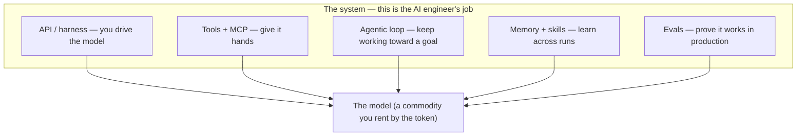

Once you internalize this, the learning path inverts. You don't spend three months on math you'll never write by hand. You spend six months learning to build the five boxes above. Here's the timeline:

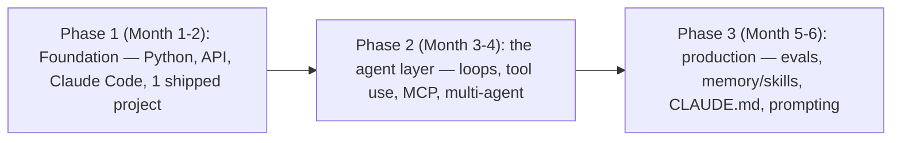

---

## Phase 1 · Month 1-2 — The Foundation

### 1. Learn *just enough* Python

You do not need three months of Python. You need four things, and everything else you learn on demand:

1. **Functions** — package logic you'll reuse.
2. **Dictionaries** — because every API request and response is one.
3. **`async`/`await`** — because you'll be waiting on network calls, and you don't want to block.
4. **How to call an API** — the single most important skill in this whole list.

If you can read the next block and explain what each line does, you're ready to move on. If you can't, spend *two weeks* on Python basics — not three months.

```python
# The whole game in one function: send text to a model, get text back.
import httpx

async def call_claude(prompt: str) -> str:
    async with httpx.AsyncClient(timeout=30) as client:
        r = await client.post(
            "https://api.anthropic.com/v1/messages",
            headers={
                "x-api-key": YOUR_KEY,
                "anthropic-version": "2023-06-01",  # current API version header
                "content-type": "application/json",
            },
            json={
                "model": "claude-sonnet-5",          # balanced tier — fine for learning
                "max_tokens": 1024,
                "messages": [{"role": "user", "content": prompt}],
            },
        )
        # The response `content` is a LIST of typed blocks, not a plain string —
        # grab the text block by type. (Don't assume content[0]: current models
        # can put a thinking block first, so index 0 may have no "text" key.)
        blocks = r.json()["content"]
        return next(b["text"] for b in blocks if b["type"] == "text")
```

**Two accuracy notes the hype posts skip:**
- In real code you'd use the official `anthropic` SDK, not hand-rolled `httpx` — it handles retries, streaming, and typing for you (`pip install anthropic` → `client.messages.create(...)`). The raw call above is just to *see the shape*.
- Model IDs move fast. As of 2026 the flagship is **Claude Fable 5** (`claude-fable-5`); **Opus 4.8** (`claude-opus-4-8`) is the top Opus-tier model, and **Sonnet 5** (`claude-sonnet-5`) is the balanced default (cheapest is **Haiku 4.5**). Ignore any roadmap that hard-codes an old ID — always check the current [models list](https://platform.claude.com/docs).

### 2. Understand the API (not just the chat window)

Using a model through its chat window is ~10% of what it can do. The API is where engineering starts, because *you* control four dials the chat box hides:

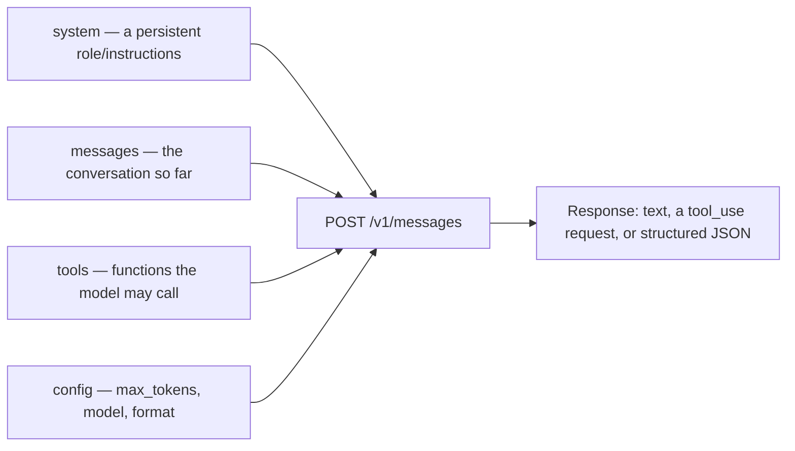

Three primitives carry the whole first month:

| Primitive | What it does |
|---|---|
| **Messages endpoint** | Send a prompt (+ history), get a response. The atom of everything. |
| **System prompt** | Give the model a persistent role: *"You are a senior backend engineer who values simple, testable code."* Changes output more than any clever wording. |
| **Tool use** | Let the model call *your* functions. This is the doorway from "chatbot" to "agent" (Phase 2). |

Don't *read* about these. **Build three tiny things:** a chatbot, a classifier, and an extractor. That's a weekend, and it teaches more than any course.

### 3. Install the coding agent (Claude Code)

Claude Code is a command-line agent: you point it at a repo and it reads, writes, tests, and commits code with you. It's the single biggest per-hour multiplier in this list — you go from typing every line to *directing* the work and reviewing diffs.

```bash
npm install -g @anthropic-ai/claude-code
cd your-project
claude
```

> The hype posts throw around a specific revenue number and a "3× more powerful" quote from the team. I'm leaving those out — I can't verify them, and the point stands without them: **coding agents are now a normal part of the workflow, and learning to drive one is table stakes.** Use it, review its output like a senior would, and you'll ship several times faster at the same quality.

### 4. Ship one real project

Tutorials teach you to *follow*. Projects teach you to *build*. Pick something small and finish it:

- A CLI that summarizes any PDF via the API.
- A Slack/Discord bot that answers questions about your own docs.
- A script that watches a webpage and alerts you when it changes.

Put it on GitHub with a README and tests. **One shipped project beats fifty certificates** — it's proof you can go from idea to working software, which is the entire hiring signal.

---

## Phase 2 · Month 3-4 — The Agent Layer

This is where most people stall. They learn the API, build a chatbot, and stop. The **$200K+ roles in 2026 are agent-engineering roles, not prompt-engineering roles.** An agent is three ideas stacked: a *loop*, *tools*, and *coordination*.

### 5. The agentic loop

A prompt is one instruction. A **loop** is a *goal* the model keeps working toward until it gets there — without you babysitting each step. Three parts make a loop actually converge instead of spinning:

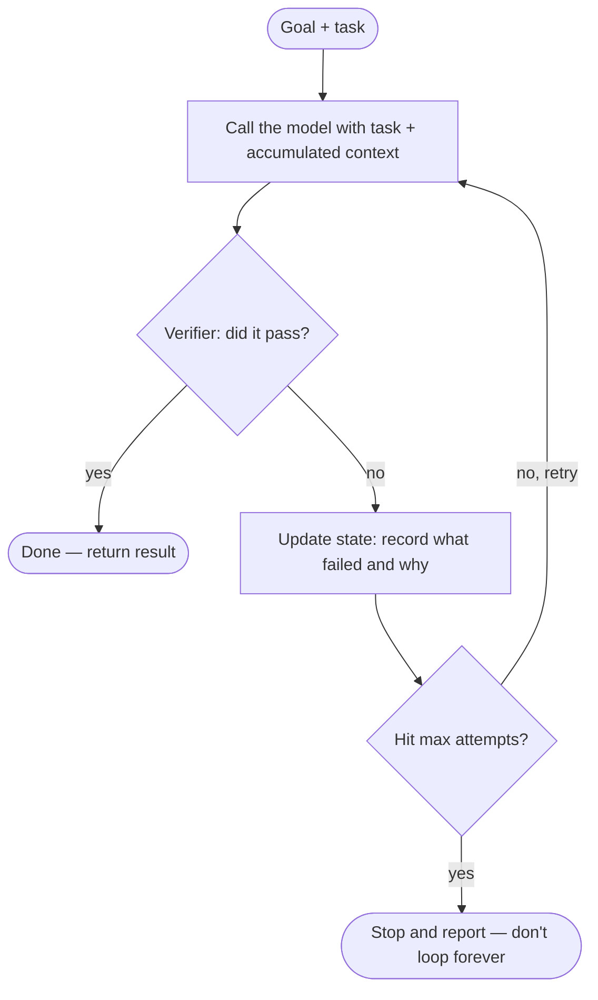

- **A verifier** turns repetition into *progress*. Without a real check (tests pass? schema valid? output matches spec?) the agent just agrees with itself on repeat.
- **State** is what makes the loop *learn*. Each pass, the model must know what it already tried, or it repeats the same mistake.
- **A stop condition** keeps it sane: the goal is met, *or* a hard limit says "after N tries, stop and report."

```python
# The simplest useful agentic loop.
done, attempts, max_attempts, context = False, 0, 5, ""

while not done and attempts < max_attempts:
    result = call_agent(task + context)     # the model, possibly with tools
    check = verify(result)                   # tests / schema / a grading rubric
    if check.passed:
        done = True
    else:
        context += f"\nAttempt {attempts} failed: {check.reason}"  # <-- state
        attempts += 1
```

### 6. Give the model hands — tool use

A model with no tools can *reason* but can't *act*. Tool use is the round trip that lets it touch your systems: **the model decides *when* to call a tool, you execute it, you hand back the result, and it continues reasoning with that result.**

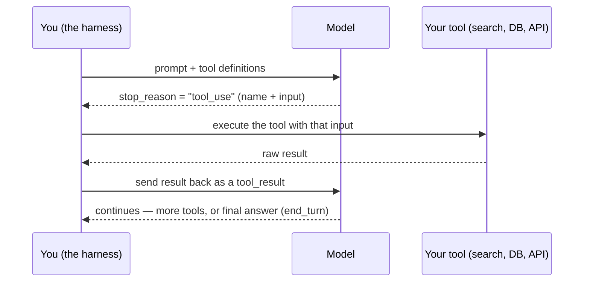

You describe a tool with a name, a plain-English description, and an input schema. The model reads the description to decide when to reach for it:

```python
tools = [{
    "name": "search_docs",
    "description": "Search internal documentation. Call this when the "
                   "user asks about company-specific facts.",
    "input_schema": {
        "type": "object",
        "properties": {"query": {"type": "string"}},
        "required": ["query"],
    },
}]
# The model emits a tool_use block; you run search_docs(query) and return a
# tool_result; the model uses it to keep going. That loop IS an agent.
```

**Portfolio project #2:** a research agent that takes a question, searches 3 sources, and returns a *cited* summary.

### 7. Learn MCP — the universal adapter

**MCP (Model Context Protocol)** is Anthropic's open standard for connecting a model to external systems. The mental model everyone uses: **it's USB-C for AI.** Instead of writing bespoke glue for every data source, you run (or connect to) an **MCP server** that exposes tools and data through one standard interface, and any MCP-aware client can plug in.

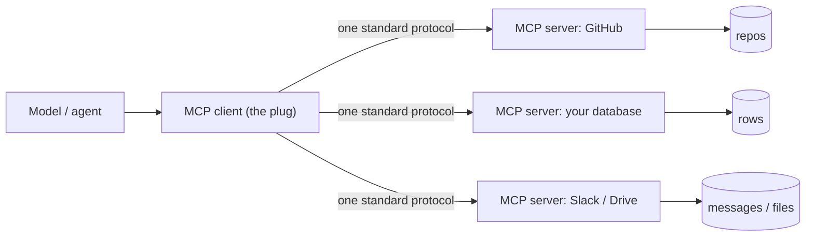

Every company building agents needs someone who can wire a model to internal systems. MCP is *how* that wiring happens in 2026 — learn it and you're the person who makes agents useful inside a real org.

**Portfolio project #3:** build an MCP server that connects a model to a real data source you care about.

### 8. Ship a multi-agent system

One agent grinding a hard task serially is slow and gets lost. An **orchestrator** spawns a *swarm* of sub-agents that work in parallel — research, write, review — then aggregates their results. Same model, different *harness*. That harness is the gap between a $100K developer and a $300K AI engineer.

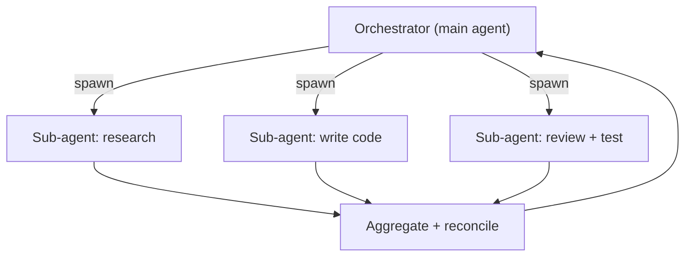

> I wrote the multi-agent pattern up in full, with runnable Python (orchestrator, debate, devil's-advocate, temperature ladder, merge), here: **[Agent Swarms →](https://github.com/wilsonwu-ai/agent-swarms).** That repo *is* this step, done.

---

## Phase 3 · Month 5-6 — The Production Layer

Building an agent that works in a demo is Month 3-4. Building one that survives real users is Month 5-6 — and this is where "AI engineers" stop and real engineers start.

### 9. Learn evaluation (evals)

Most agents work in the demo and break in production. The difference is **evaluation** — you never trust "it looked right once," you *measure* it against a fixed set of cases and watch the score as you change things.

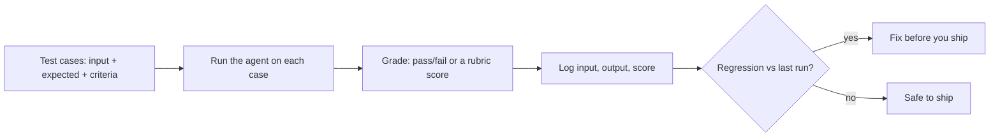

```python
# An eval is embarrassingly simple — and it's what keeps you honest.
cases = [{"input": "...", "expected": "...", "criteria": "..."}]
for c in cases:
    out = run_agent(c["input"])
    score = grade(out, c["expected"], c["criteria"])   # rules, or a model-as-judge
    log(c, out, score)
```

Ask any AI startup what killed their first product. The answer is almost always the same: *no evals.*

### 10. Build memory and skills

An agent without memory makes the same mistake on run #50 as on run #1. **Memory** persists what it learned across sessions; **skills** package a *whole workflow* it can reuse. Together they mean the system around the model gets smarter over time — a moat a competitor can't copy in a week, because it's built from *your* months of real runs.

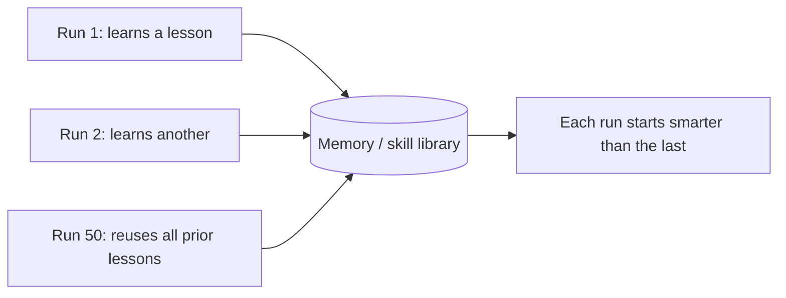

This isn't hand-wavy — Anthropic ships a **memory tool** (the model reads/writes a memory directory you control) and **Agent Skills** (packaged, on-demand instructions) as real API features. Learn to capture a workflow once — the input shape it expects, the steps that worked, the output format, the validation rules — and you stop re-explaining it every session.

### 11. Master CLAUDE.md

A `CLAUDE.md` file at the root of a repo is the coding agent's standing instructions — your engineering standards, in plain markdown, that it reads on every task. Without it, the agent guesses your conventions. With it, the agent follows *your* house style.

```markdown
# CLAUDE.md

## Project
E-commerce API. Python 3.12, FastAPI, PostgreSQL.

## Rules
- All endpoints return JSON as {data, error, meta}
- No ORM for queries over 3 joins — raw SQL
- Every new endpoint needs a test in tests/api/
- Commit messages: type(scope): description

## Architecture decisions
- Event sourcing for orders (see docs/adr-003.md)
- Redis for session cache, not the database
```

The difference between an agent that guesses and one that follows your standards is night and day — and it costs you ten minutes to write.

### 12. Prompt engineering — the six rules that actually move output

Most prompt advice ("be specific," "give context") is common sense, not engineering. These six actually change output quality — I've stated them in my own words:

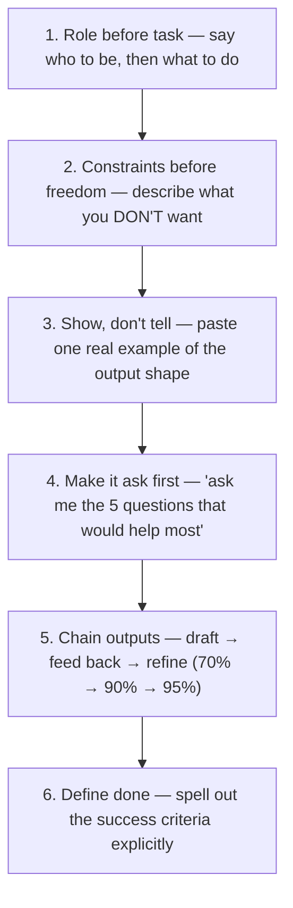

1. **Role before task.** "You are a senior backend engineer who values simple, testable code over clever abstractions" turns a Stack-Overflow snippet into production code.
2. **Constraints before freedom.** "Standard library only, every function under 20 lines, type hints everywhere." Boundaries force better work.
3. **Show, don't describe.** One pasted example of the exact output format beats ten sentences describing it — the model matches structure, tone, and detail.
4. **Ask the model to ask *you* first.** "Before you start, ask me the 5 questions that would most help you do this well." Catches misunderstandings before they cost a rewrite.
5. **Chain outputs.** Get a draft, feed it back, ask it to fix specific parts. The model doesn't get tired — use that.
6. **Tell it what "done" looks like.** "All 23 routes have validation, every route has ≥2 tests, no type errors, and you ran the tests and they pass." If the model doesn't know what done means, it decides for itself.

---

## The whole stack, one picture

Zoom out and the six months are just you learning to build every layer between a user and a rented model:

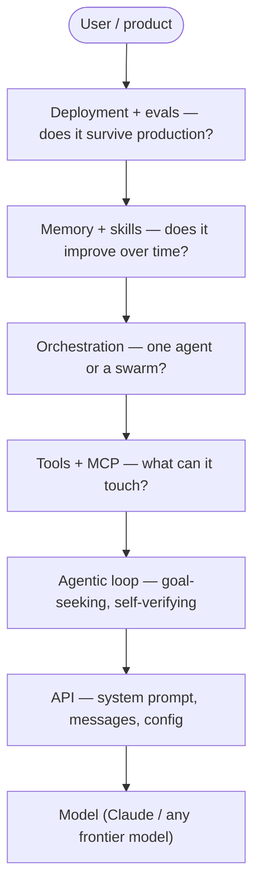

A chat box is a vending machine. A custom harness like this is an operating system — and building operating systems is the job.

---

## The portfolio that gets you hired

Three shipped projects, one per capability, each mapped to a phase:

| # | Project | Proves | Phase |
|---|---------|--------|-------|
| 1 | CLI / bot that uses the API | You can call a model and ship software | 1 |
| 2 | Research agent (tool use + loop) | You can build something *autonomous* | 2 |
| 3 | MCP server + a small multi-agent system | You can wire models into real systems | 2-3 |

Add a fourth if you want to stand out: a public write-up of something you learned deeply (an eval harness, a serving deep-dive, a frontier-model teardown). Teaching in public *is* portfolio — it's why these repos exist.

---

## The honesty box (what I changed from the source)

The write-up that prompted this was motivating but ran hot on a few claims. Rather than repeat numbers I can't stand behind, I flagged them:

- **Salaries** ("$250K-$450K"): real senior AI-engineering comp at top companies *can* reach those bands, but it varies enormously by location, company, and level. Treat it as motivation, not a promise.
- **"$400M revenue in months" / "3× more powerful than X" quotes:** unverified specifics and attributed quotes — omitted. The underlying point (coding agents are now standard; use one) holds without them.
- **"CLAUDE.md hit #1 with 82,000 stars":** I couldn't verify the specific figure, so I described *what CLAUDE.md does* instead. The feature is real and useful regardless of any leaderboard.
- **The stale model ID** in the original code (`claude-sonnet-4-6`): updated to a current model and paired with a note to always check the live models list — hard-coding an ID is exactly the kind of thing that rots.

The roadmap itself — reframe → foundation → agent layer → production → portfolio — is solid, which is why I wrote it up. The rule of thumb: **be skeptical of the numbers, follow the structure.**

---

## Credits & further reading

- **Prompt:** [@0xCodez](https://x.com/0xCodez) / [movez.substack.com](https://movez.substack.com) — the Claude-first AI-engineer write-up, and Google's 1-hour "AI engineer in 2026" course.
- **The docs to actually read:** [platform.claude.com/docs](https://platform.claude.com/docs) — Messages API, tool use, MCP, memory, skills. Build the three tiny projects *from* the docs; don't just read them.
- **These concepts, done in code:** [Agent Swarms](https://github.com/wilsonwu-ai/agent-swarms) (multi-agent) · [Inference Engineering](https://github.com/wilsonwu-ai/inference-engineering) (how serving actually works — Phase 3 systems knowledge) · [How Kimi scales open models](https://github.com/wilsonwu-ai/scaling-open-models) (frontier-model literacy).

*Roadmap by [Wilson Wu](https://www.linkedin.com/in/wilson1wu/) — operator learning to build with AI, walking this path in public. [github.com/wilsonwu-ai](https://github.com/wilsonwu-ai). Explanations and diagrams are mine; the structure was prompted by the sources above. Numbers are theirs and flagged where I couldn't verify them. Licensed [CC BY 4.0](https://creativecommons.org/licenses/by/4.0/).*
